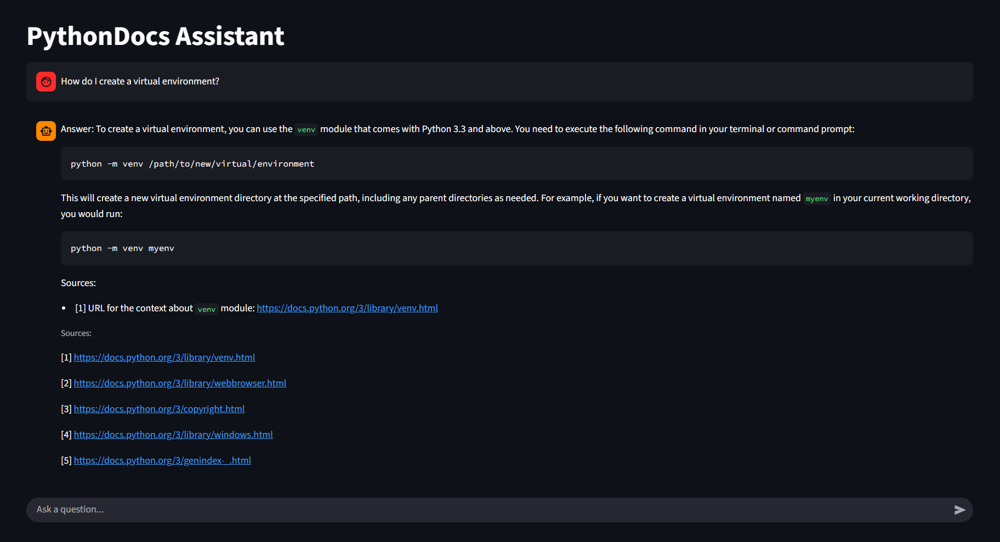

# PythonDocs Assistant

A **Retrieval-Augmented Generation (RAG)** chatbot that answers Python questions using the **official documentation** as its knowledge base.  
It retrieves relevant doc snippets, grounds the answer with citations, and provides a clean chat UI powered by Streamlit.

---

## Features

- **Retrieval-Augmented Generation** pipeline (embed → FAISS → retrieve → prompt → generate)
- **Domain-specific knowledge**: built from `docs.python.org`
- **Grounded answers** with inline citations and source URLs
- **Streamlit chat interface** for interactive Q&A
- **Automated evaluation** comparing RAG vs. a baseline (no-context) model
- **Dockerized + config-driven** for easy reproducibility

---

## Architecture Overview

```text
User question
   │
   ▼
 Embed question ─► FAISS search (top-k chunks from Python docs)
   │
   ▼
 Prompt = [system + retrieved context + question]
   │
   ▼
 LLM (Ollama or OpenAI) ─► Answer + Citations
```

**Baseline (`no_ctx`)** → sends question directly to LLM.  
**RAG** → augments question with retrieved context from the docs.

---

## Installation & Setup

```bash
# 1. Create environment
python -m venv .venv
.venv\Scripts\activate
pip install --upgrade pip
pip install -r requirements.txt

# 2. (Option A) Use Ollama locally
ollama pull mistral:instruct
#  or  ollama pull llama3.1:8b-instruct

# 3. (Option B) Use OpenAI / compatible provider
# export or set your key
setx OPENAI_API_KEY "sk-..."

# 4. Build the index from Python docs
python ingest.py --config config\config.yaml

# 5. Run the Streamlit chat app
streamlit run app.py
```

---

## Seeds (docs.python.org)

```
https://docs.python.org/3/tutorial/index.html
https://docs.python.org/3/library/index.html
https://docs.python.org/3/faq/programming.html
https://docs.python.org/3/howto/logging.html
https://docs.python.org/3/library/dataclasses.html
https://docs.python.org/3/library/functools.html
https://docs.python.org/3/library/concurrent.futures.html
https://docs.python.org/3/library/asyncio-task.html
https://docs.python.org/3/library/os.path.html
https://docs.python.org/3/library/pathlib.html
https://docs.python.org/3/library/typing.html
https://docs.python.org/3/library/shutil.html
https://docs.python.org/3/library/re.html
https://docs.python.org/3/library/argparse.html
```

---

## Example Interaction

**User:**  
> How do I create a virtual environment?

**Assistant:**  
> You can use the built-in `venv` module:  
> ```bash
> python -m venv .venv
> ```
> This creates an isolated environment for dependencies.  
>
> **Sources:**  
> [1] https://docs.python.org/3/library/venv.html




---

## Evaluation

**Goal:** compare baseline LLM vs. RAG pipeline on factual Python-docs questions.

- Dataset: **50 curated questions** (`eval/qas.jsonl`)
- Metric: robust substring/keyword match
- Models: `mistral:instruct` via Ollama
- Runtime: ~1 hour on CPU

| Strategy | Correct | Total | Accuracy |
|---------:|--------:|------:|---------:|
| no_ctx   | 34      | 50    | 68 %     |
| RAG      | 43      | 50    | 86 %     |

**Head-to-head:** RAG answered 11 questions correctly that the baseline missed, and lost on only 2.  
RAG improved factual accuracy by **~18 percentage points**.

---

## Example Evaluation Command

```bash
python eval.py --config config\config.yaml
python summarize_eval.py eval\results.csv
```

**Output:**
```
no_ctx  34/50 = 68.0%
rag     43/50 = 86.0%

Head-to-head:
- RAG wins vs baseline on 11 question(s): ['6', '7', '14', '17', '21', '25', '28', '32', '33', '35', '36']
- RAG loses to baseline on 2 question(s): ['31', '47']
```

---

## How It Works

| Component | Purpose |
|------------|----------|
| **Scraper** | Downloads and cleans Python docs HTML |
| **Chunker** | Splits text into ~800-token sections |
| **Embedder** | Uses `e5-small-v2` to create dense vector embeddings |
| **FAISS Index** | Enables fast semantic retrieval |
| **Retriever** | Finds top-k relevant chunks for a query |
| **Prompt Builder** | Injects retrieved context + question into LLM |
| **LLM Client** | Supports both Ollama (local) and OpenAI APIs |
| **Streamlit UI** | Interactive front-end showing answers + sources |
| **Eval Pipeline** | Compares baseline vs. RAG accuracy |

---

## Project Structure

```text
├── app.py                  # Streamlit chat interface
├── ingest.py               # Crawl, chunk, embed, and index docs
├── eval.py                 # Evaluation script (RAG vs baseline)
├── summarize_eval.py       # Summarize CSV results
├── config/config.yaml      # Central configuration
├── data/                   # Seeds, raw docs, processed text
├── index/                  # FAISS index + metadata
├── eval/qas.jsonl          # Evaluation question set
├── raglab/                 # Core RAG modules
│   ├── scrape.py
│   ├── chunk.py
│   ├── embed.py
│   ├── index.py
│   ├── retrieve.py
│   ├── prompt.py
│   ├── llm.py
│   └── pipeline.py
└── assets/
    └── chat-example.png
```

---

## Future Improvements

- Add **LLM-as-judge** evaluation for nuanced grading  
- Stream answer tokens for faster perceived latency  
- Support hybrid retrieval (BM25 + embeddings)  
- Experiment with **quantized models** for faster inference  
- Fine-tune retriever or LLM on domain Q&A pairs  

---

## License

MIT License © 2025 — *Federico García*
